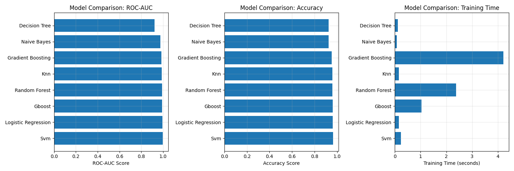
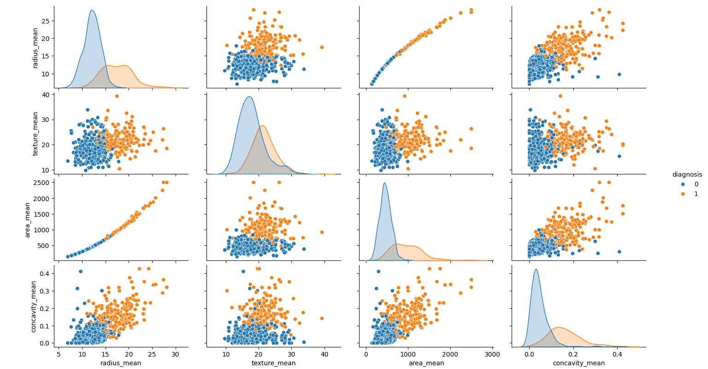

# OncoScan 🦠: A Machine Learning Diagnostic Tool for Breast Cancer


---

## 🌐 Live Demo

**▶️ Try the web app here**: [https://oncoscan-a-machine-learning-diagnostic-tool-for-breast-cancer.streamlit.app/](https://oncoscan-a-machine-learning-diagnostic-tool-for-breast-cancer.streamlit.app/)

---

## 📊 Project Overview

**OncoScan** is an interactive machine learning web app built with **Streamlit** that analyzes cell nuclei features to predict whether a breast tumor is **malignant** or **benign**, based on the Wisconsin Diagnostic Breast Cancer Dataset.

This project showcases a complete end-to-end ML pipeline:

- Exploratory Data Analysis (EDA)
- Preprocessing
- Model training and hyperparameter tuning
- Evaluation and comparison
- Deployment via Streamlit

---

## 📂 Repository Structure

```
.
├── __pycache__/
├── data/
│   └── Breast_cancer_dataset.csv
├── models/
│   ├── best_breast_cancer_model.joblib
│   ├── feature_scaler.joblib
│   └── model_info.json
├── results/
│   ├── Logistic_Regression_detailed_analysis.png
│   ├── Model_Comparison.png
│   ├── class distribution of diagnosis.png
│   ├── heatmap of correlation matrix.png
│   └── pairplot.png
├── breast_cancer_eda.py
├── breast_cancer_preprocessing.py
├── evaluation_pipeline.py
├── main.py
├── model_loader.py
├── streamlit_app.py
├── requirements.txt
```

---

## 🎯 Features

- ✨ **Clean UI/UX** built with Streamlit and custom CSS
- ✅ Logistic Regression model trained on top 20 selected features
- ⚖️ ROC-AUC \~99.5% | Accuracy \~96.5%
- 🔹 Feature contribution visualization (normalized bar chart)
- 🔍 Data exploration: EDA visualizations, class distribution, correlation heatmaps
- 📋 Quick-load example values for benign and malignant cases
- 🌍 Live prediction + confidence score + feature importance

---

## 🚀 How to Run Locally

### 1. Clone the Repository

```bash
git clone https://github.com/yourusername/oncoscan-breast-cancer-predictor.git
cd oncoscan-breast-cancer-predictor
```

### 2. Install Dependencies

```bash
pip install -r requirements.txt
```

### 3. Train the Model (optional)

```bash
python main.py
```

### 4. Create Deployment Model (optional)

```bash
python model_loader.py
```

### 5. Run the App

```bash
streamlit run streamlit_app.py
```

---

## 🎓 Dataset Info

- **Dataset**: Wisconsin Diagnostic Breast Cancer
- **Samples**: 569
- **Classes**: Malignant (M), Benign (B)
- **Features**: 30 total, reduced to top 20 via selection

---

## 📊 Sample Visualizations

|  |  |
| --------------------------------- | -------------------------------------------------------- |
| Model Comparison                  | Diagnosis Class Distribution                             |

|  |          |
| ---------------------------------------------------- | --------------------------------- |
| Correlation Heatmap                                  | Pairplot                          |


---

---

## 🌐 Deployment

This app is live and hosted via **Streamlit Cloud**.

To deploy your own version:

1. Push your code to a GitHub repo
2. Connect your repo to [Streamlit Cloud](https://streamlit.io/cloud)
3. Add `requirements.txt` and `streamlit_app.py`

---

## 🚫 Disclaimer

This tool is for **educational and research purposes only**. It is not intended for medical diagnosis. Always consult qualified medical professionals.

---

## 👨‍💼 Author

This project was built with care, love, and curiosity by someone chasing a dream. Even when the dream changes shape, the journey continues.

> *"✨ Built with ❤️ (and Python) by Harjot / Iris. Thank you for visiting."*

